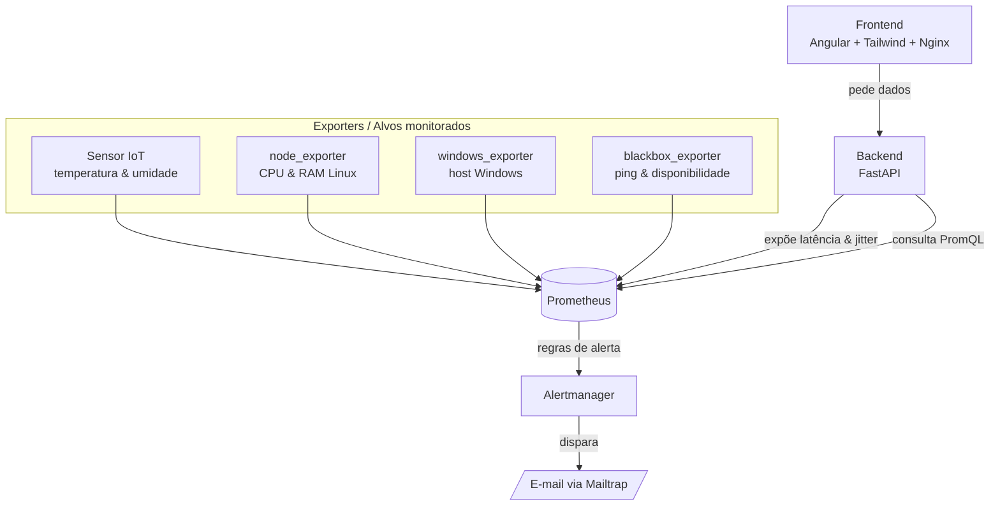

# 🛰️ Painel de Observabilidade — IoT + Prometheus

[](https://github.com/santhiago4343434343/OBSERVABILIDADE-PROMETHEUS-DASHBOARD-IoT-BACKUP-V1/actions/workflows/ci.yml)


> Plataforma full-stack de **observabilidade** que monitora, em tempo real, a saúde de serviços, a infraestrutura (CPU/RAM) e **sensores IoT** (temperatura/umidade) — tudo num único painel, com **alertas automáticos por e-mail** e **pipeline CI/CD** completo.

---

## 🎯 Sobre o projeto

Em ambientes reais, a informação sobre "o que está no ar", "quão rápido está respondendo" e "como está a infraestrutura" costuma ficar espalhada. Este projeto centraliza tudo isso num só lugar: um painel que coleta métricas de várias fontes (serviços web, máquina e sensores IoT), avisa por e-mail quando algo cai e volta, e é entregue com um pipeline de CI/CD que só publica código validado.

O objetivo é demonstrar, na prática, um fluxo de observabilidade e DevOps no **padrão de mercado**.

## 🖼️ Preview

> 📸 _Screenshot do painel em breve — rodando localmente em `http://localhost:8080`._

## 🏗️ Arquitetura



**Como os dados fluem:** os *exporters* expõem métricas; o **Prometheus** faz o *scrape* de todos eles em intervalos regulares; quando uma regra de alerta é violada (ex.: um serviço fora do ar), o Prometheus avisa o **Alertmanager**, que envia um e-mail. Em paralelo, o **frontend** Angular pede dados ao **backend** FastAPI, que consulta o Prometheus via PromQL e devolve os números já prontos para os gráficos.

## 🧰 Stack

| Camada | Tecnologias |
|---|---|
| **Backend** | Python, FastAPI |
| **Frontend** | Angular 18, Tailwind CSS v4, Nginx |
| **Observabilidade** | Prometheus, Alertmanager, blackbox_exporter, node_exporter, windows_exporter |
| **Sensor IoT** | Exporter em Python (temperatura/umidade) |
| **Infra** | Docker, Docker Compose |
| **CI/CD** | GitHub Actions, GitHub Container Registry (GHCR) |

## ✨ Funcionalidades

- **Latência e jitter** dos serviços monitorados
- **Ping e disponibilidade** via blackbox_exporter
- **CPU e RAM** da máquina (node_exporter / windows_exporter)
- **Sensores IoT** de temperatura e umidade
- **Alertas automáticos por e-mail** com template customizado (mensagem diferente para "fora do ar" 🔴 e "restabelecido" ✅)
- **Pipeline CI/CD** com portão de qualidade: só publica imagens que passaram na validação

## 🚀 Como rodar localmente

**Pré-requisitos:** Docker e Docker Compose instalados.

```bash
# 1. Clonar o repositório
git clone https://github.com/santhiago4343434343/OBSERVABILIDADE-PROMETHEUS-DASHBOARD-IoT-BACKUP-V1.git
cd OBSERVABILIDADE-PROMETHEUS-DASHBOARD-IoT-BACKUP-V1

# 2. Configurar o Alertmanager (o arquivo real fica fora do Git por conter segredo)
cp alertmanager/alertmanager.yml.example alertmanager/alertmanager.yml
# edite alertmanager/alertmanager.yml e preencha as credenciais do Mailtrap

# 3. Subir tudo
docker compose up -d
```

**URLs depois de subir:**

| Serviço | URL |
|---|---|
| 🖥️ Painel (Angular) | http://localhost:8080 |
| 📊 Prometheus | http://localhost:9090 |
| 🔔 Alertmanager | http://localhost:9093 |

## 🔔 Alertas

A regra em `prometheus/alerts.yml` observa a disponibilidade dos alvos (`probe_success == 0`). Quando um serviço fica fora do ar por mais de 1 minuto, o Prometheus dispara o alerta para o **Alertmanager**, que envia um e-mail via **Mailtrap** — com um template HTML customizado. Quando o serviço volta, um segundo e-mail de **restabelecido** é enviado automaticamente (`send_resolved`).

## 🔄 CI/CD

O pipeline (`.github/workflows/ci.yml`) roda no GitHub Actions em dois estágios:

1. **`build` (CI)** — valida o `docker-compose` e builda todas as imagens. É o **portão de qualidade**.
2. **`publish` (CD)** — só roda **se o `build` passar** (`needs: build`) e apenas na branch `main`. Publica as imagens no **GHCR** usando uma `matrix` para os 3 serviços em paralelo.

Ou seja: **código quebrado nunca vira imagem publicada.** O badge no topo deste README reflete o status atual do pipeline.

## 📂 Estrutura

**
"
.
├── .github/workflows/ci.yml # pipeline CI/CD
├── backend/ # API FastAPI
├── sensor/ # exporter IoT (Python)
├── frontend/ # Angular 18 + Tailwind v4 (servido por Nginx)
├── prometheus/
│ ├── prometheus.yml # scrape + regras + alerting
│ └── alerts.yml # regra de disponibilidade
├── alertmanager/
│ ├── alertmanager.yml.example # modelo de config (sem segredo)
│ └── email.tmpl # template HTML do e-mail
├── blackbox/
│ └── blackbox.yml # config do blackbox_exporter
└── docker-compose.yml


## 🗺️ Roadmap

- [x] **Bloco 1** — métricas (latência/jitter, ping, CPU/RAM, sensor IoT) + gráficos
- [x] **Bloco 2** — alertas automáticos por e-mail + pipeline CI/CD
- [ ] **Projeto 2** — orquestração com **Kubernetes (k3s)**: um app novo rodando no cluster, monitorado por este painel

## 👤 Autor

**Santhiago** · [GitHub](https://github.com/santhiago4343434343)
